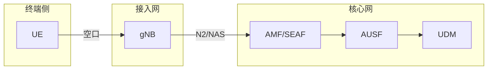
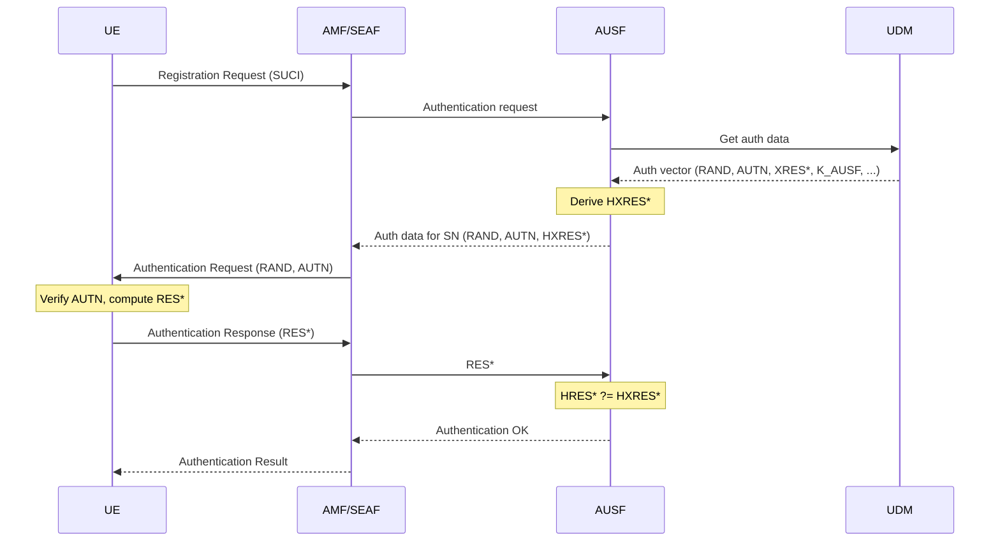
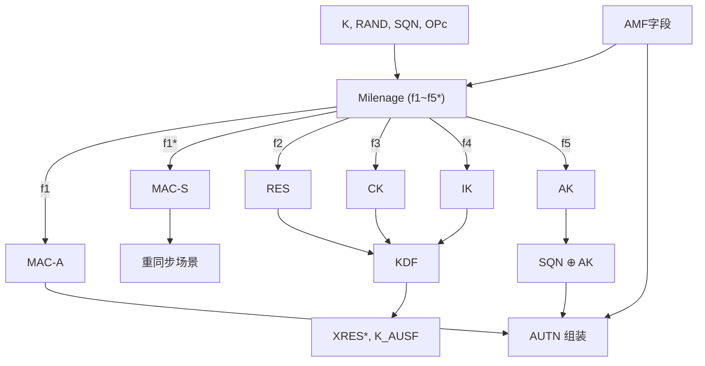
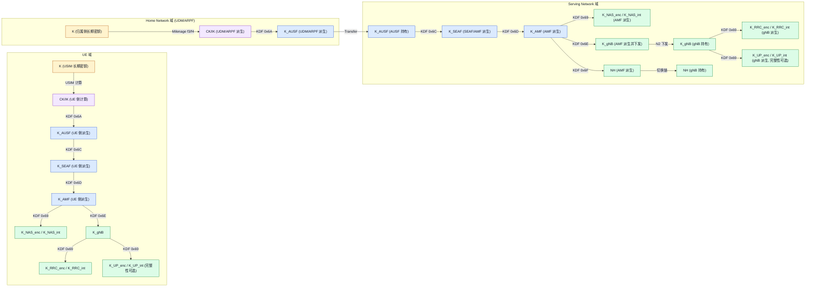
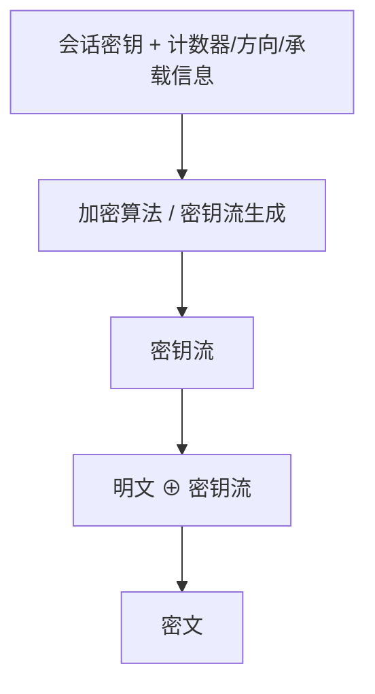

> 本文围绕 5G 安全体系的主线展开，重点说明四个问题：5G 要保护什么、认证链路如何建立、密钥如何逐级派生，以及这些机制最终怎样落到空口与核心网通信中。

---

## 目录

- [1. 网络架构与安全域](#1-网络架构与安全域)
- [2. 用户标识与隐私保护](#2-用户标识与隐私保护)
- [3. 5G-AKA 认证机制](#3-5g-aka-认证机制)
- [4. Milenage 算法族](#4-milenage-算法族)
- [5. 密钥派生体系](#5-密钥派生体系)
- [6. 数据安全保护](#6-数据安全保护)
- [7. SBI 服务接口](#7-sbi-服务接口)
- [8. 安全机制对比分析](#8-安全机制对比分析)

---

## 1. 网络架构与安全域

5G 核心网由一组核心网功能构成，负责注册、认证、会话管理、策略控制和订阅数据管理，位于基站之后，承接 UE 发起的接入请求。接入与认证沿以下主路径完成：



### 1.1 核心网中的安全角色

前文给出了实体主链路，这里进一步按角色展开各网元的安全职责：

| 组件 | 全称 | 所在位置 | 安全职责 |
|------|------|----------|----------|
| **UE** | User Equipment | 终端侧 | 保存 USIM 中的长期凭据，参与认证与密钥计算 |
| **gNB** | Next Generation NodeB | 接入网 | 承载 RRC 和用户面安全，执行空口保护 |
| **AMF** | Access and Mobility Management Function | 核心网 | 接入与移动性管理，承载 NAS 安全上下文 |
| **SEAF** | Security Anchor Function | AMF 内部逻辑角色 | 作为服务网络侧安全锚点，承接认证结果和后续密钥使用 |
| **AUSF** | Authentication Server Function | 核心网 | 负责 5G-AKA 认证协调与认证结果确认 |
| **UDM** | Unified Data Management | 核心网 | 管理订阅信息与长期密钥材料，并承接认证相关数据处理 |

其中，SEAF 是服务网络侧的安全锚点角色，通常由 AMF 承接，并不对应独立部署的物理网元。这一点有助于理解为什么后续很多密钥围绕 `K_SEAF` 和 `K_AMF` 展开，AUSF 主要承担认证协调与结果确认职责。

### 1.2 安全问题与分层边界

5G 安全主要处理以下几类问题，这些问题分别出现在终端、空口接入、注册认证、核心网调用和应用访问等不同位置。

| 风险 | 首先暴露的位置 | 主要安全域 | 典型机制 |
|------|----------------|------------|----------|
| 身份泄露 | 终端发起接入、空口上传身份时 | 网络接入安全 | SUCI、身份隐藏机制 |
| 伪装接入 | UE 与接入网建立注册关系时 | 网络接入安全 | 5G-AKA、AUTN 验证 |
| 重放攻击 | 注册信令和后续控制面交互 | 网络接入安全 | SQN、COUNT、上下文校验 |
| 链路窃听 | 空口传输和核心网内部链路 | 接入安全 / 网络域安全 | NAS/RRC/UP 加密、TLS |
| 调用冒用 | 核心网服务间调用 | 网络域安全 / SBA 安全 | 证书、mTLS、令牌机制 |
| 本地凭据泄露 | USIM 与终端本地环境 | 用户域安全 | 长期密钥保护、本地访问控制 |
| 业务侧未授权访问 | 应用服务和业务接口 | 应用域安全 | 应用层鉴权、端到端加密 |

对应到系统边界，安全域可归纳为以下几类：

| 安全域 | 保护对象 | 典型机制 |
|--------|----------|----------|
| **网络接入安全** | UE 与接入网络之间的注册、认证、空口信令 | 5G-AKA、NAS/RRC/UP 安全 |
| **网络域安全** | 核心网网元间通信 | IPSec、TLS、证书体系 |
| **用户域安全** | USIM 与终端本地环境 | 长期密钥保护、本地访问控制 |
| **应用域安全** | 应用层端到端业务 | TLS、应用层鉴权与加密 |
| **SBA 安全** | 核心网服务化接口调用 | mTLS、OAuth2、令牌校验 |

---

## 2. 用户标识与隐私保护

在认证开始之前，网络先要识别“是谁在接入”。永久身份一旦直接出现在空口，就会带来长期追踪风险。因此 5G 将“用户真实身份”和“空口上传输的身份”分开处理。

### 2.1 永久身份：SUPI

用户在运营商系统中的长期身份标识称为 **SUPI**（Subscription Permanent Identifier）。它用于唯一标识订阅关系，本质上是运营商侧需要长期维护的用户身份。

常见的 SUPI 形式是 IMSI 风格编码，典型格式如下：

```
imsi-MCC-MNC-MSIN
```

示例：

```
imsi-460-19-0111120007
```

| 字段 | 作用 |
|------|------|
| `imsi` | 表示该 SUPI 采用 IMSI 形式编码 |
| `MCC` | 移动国家码，例如中国通常为 `460` |
| `MNC` | 移动网络码，例如 `19` |
| `MSIN` | 移动用户识别号，例如 `0111120007` |

在实际编码中，这几个字段也可能直接连续拼接显示，因此常见字符串形式也会写成 `imsi-460190111120007`。

SUPI 的特点是稳定、唯一、可用于后端检索用户订阅信息；它的问题也正源于此：一旦长期在空口中明文出现，攻击者就能将设备与位置、活动轨迹持续关联。

### 2.2 空口身份：SUCI

为避免直接暴露永久身份，5G 在空口上传输 **SUCI**（Subscription Concealed Identifier）。它由 SUPI 转换而来，用于替代 SUPI 出现在接入请求中。两者关系如下：**SUPI 是用户的真实长期身份，SUCI 是 SUPI 在空口传输时的受保护表示**。终端发起接入时生成 SUCI，不上传明文 SUPI；归属网络完成解析后，再恢复出对应的 SUPI，用于后续认证和订阅数据查询。

典型格式如下：

```
suci-MCC-MNC-路由指示-保护方案-公钥索引-隐藏内容
```

示例：

```
suci-460-19-0-2-1-abc123def456...
```

| 字段 | 作用 |
|------|------|
| `suci` | 标识该字符串是隐藏身份 |
| `MCC-MNC` | 指示归属网络 |
| `路由指示` | 帮助网络将请求路由到对应的归属网络 |
| `保护方案` | 指示所用的身份保护机制 |
| `公钥索引` | 指向归属网络用于解密的公钥版本 |
| `隐藏内容` | 对用户标识敏感部分加保护后的结果 |

从处理流程看，终端侧执行的是 `SUPI → SUCI`，归属网络侧执行的是 `SUCI → SUPI`。因此，SUCI 解决的是传输阶段的身份暴露问题，SUPI 仍然是运营商系统内部用于识别用户的原始身份。

## 3. 5G-AKA 认证机制

在身份保护完成后，系统需要进一步验证接入方是否持有合法订阅凭据，并由终端确认认证挑战来源可信。5G-AKA 用于在注册过程中完成双向认证，并建立后续安全上下文的密钥基础。

### 3.1 认证流程

**服务网络**（Serving Network, SN）指 UE 当前接入并发起注册的网络一侧，通常由 AMF/SEAF 代表；**归属网络**（Home Network, HN）指保存用户订阅信息和长期认证材料的一侧，通常由 UDM 及其相关认证功能承接。

5G-AKA 的认证链路包括五个步骤：

1. UE 向服务网络发起注册，请求中携带 SUCI。
2. AMF 触发认证流程，AUSF 向 UDM 请求该用户的认证向量。
3. UDM 基于长期凭据和本次认证输入生成认证向量，并返回给 AUSF。该向量至少包含 `RAND`、`AUTN`、`XRES*`、`K_AUSF`；其中 `RAND` 是随机挑战，`AUTN` 是网络认证令牌，两者都来自归属网络生成的认证向量。
4. AUSF 基于 `XRES*` 计算 `HXRES*`，再将 `RAND`、`AUTN` 和 `HXRES*` 下发给 AMF/SEAF。AMF/SEAF 随后向 UE 发送认证请求。
5. UE 校验 `AUTN` 后计算 `RES*`，并通过 AMF/SEAF 回送给 AUSF。AUSF 对 UE 返回的 `RES*` 计算 `HRES*`，并与已保存的 `HXRES*` 比对；比对成功后返回认证成功结果，并建立后续安全上下文。

`RAND` 和 `AUTN` 由认证向量产生并下发给 UE，`RES*` 由 UE 计算后沿原链路回送，最终由 AUSF 与认证向量派生得到的校验值完成比对。

在网元关系上，这个过程仍然沿着 UE、AMF/SEAF、AUSF、UDM 这条链路展开：



### 3.2 认证向量中的核心参数

认证向量由归属网络生成，是一次 5G-AKA 认证所需的成套参数。对 5G-AKA 而言，认证向量的核心内容包括 `RAND`、`AUTN`、`XRES*` 和 `K_AUSF`。

| 数据项 | 生成位置 | 计算基础 / 算法 | 作用 |
|--------|----------|-----------------|------|
| **RAND** | 归属网络侧 | 随机数生成 | 作为本次认证的随机挑战 |
| **AUTN** | 归属网络侧 | 基于 `SQN`、`AMF`、`AK`、`MAC-A` 组装；其中 `AK` 和 `MAC-A` 由 Milenage 计算 | 向 UE 证明挑战来自合法网络 |
| **XRES\*** | 归属网络侧 | 先由 Milenage 计算 `RES`、`CK`、`IK`，再通过 5G KDF 派生 | 作为网络侧保存的期望响应值 |
| **K_AUSF** | 归属网络侧 | 基于 `CK`、`IK` 和上下文参数通过 5G KDF 派生 | 作为认证成功后的上层锚定密钥 |

认证向量中的主要参数都在归属网络侧形成。`UDM` 使用用户长期凭据和本次认证输入先执行 Milenage，得到 `MAC-A`、`RES`、`CK`、`IK`、`AK` 等基础结果；再组装 `AUTN`，并通过 5G KDF 派生 `XRES*`、`K_AUSF`，最后把 `RAND`、`AUTN`、`XRES*`、`K_AUSF` 等内容组织成认证向量。`AUSF` 主要负责认证协调与结果确认。

这些参数可分为三类：

- `RAND`：直接作为随机挑战生成。
- `AUTN`：由序列号 `SQN`、认证管理字段 `AMF`、匿名密钥 `AK` 和网络认证码 `MAC-A` 组合得到，其中 `AK`、`MAC-A` 来自 Milenage。
- `XRES*` 和 `K_AUSF`：先依赖 Milenage 得到认证基础结果 `RES`、`CK`、`IK`，再结合服务网络名称等上下文通过 5G KDF 派生。

因此，认证向量中的参数分两层完成：第一层由 Milenage 生成 `MAC-A`、`RES`、`CK`、`IK`、`AK` 等认证基础结果，第二层由 5G KDF 基于这些结果派生 `XRES*`、`K_AUSF` 等 5G 输出。

相关算法计算的具体展开位置如下：

- `AUTN`、`RES`、`CK`、`IK`、`AK`、`MAC-A` 的计算机制，见 [4. Milenage 算法族](#4-milenage-算法族)。
- `RES*`、`K_AUSF`、`K_SEAF`、`K_AMF` 等带上下文绑定的派生机制，见 [5. 密钥派生体系](#5-密钥派生体系)。

### 3.3 双向认证建立机制

5G-AKA 的关键不只是“网络验证 UE”，还包括“UE 验证网络”。双向认证分别依赖不同参数完成：

- **网络验证 UE**：网络根据 UE 返回的 `RES*`，确认对方是否持有正确的长期认证材料。
- **UE 验证网络**：UE 根据 `AUTN` 中的认证信息，确认发起挑战的一侧确实来自可信网络，而非伪造接入实体。

因此，`RES* / XRES*` 解决的是“用户是否可信”，`AUTN` 解决的是“网络是否可信”。两者同时成立，5G-AKA 才能完成闭环。

### 3.4 认证成功后的产物

认证成功后，系统会形成后续密钥派生和安全上下文建立所需的具体产物。

认证结果本身首先建立，即服务网络确认该 UE 已通过 5G-AKA 认证，可以继续进入安全模式建立和注册后续流程。

认证锚定密钥材料随后形成。在这一阶段，归属网络侧和 AUSF 已经形成 `K_AUSF`，它是后续服务网络锚定密钥 `K_SEAF` 的上层输入。对服务网络来说，后续派生出的 `K_SEAF` 具有直接使用意义，因为服务网络侧需要以它为锚点继续建立本次接入的安全上下文。

后续派生所需的上下文参数也在这一阶段确定。这些参数与认证结果一起，支撑后续生成 `K_AMF`，再进一步派生 NAS 安全密钥、基站相关密钥以及切换相关密钥。认证阶段同时确定可信性和后续密钥派生起点。

`3.4` 的核心包括三项输出：

- **认证结论**：UE 已通过网络与归属侧的联合校验。
- **密钥锚点**：形成 `K_AUSF`，并为后续得到 `K_SEAF`、`K_AMF` 提供起点。
- **安全上下文起点**：为后续 NAS、RRC、用户面以及切换相关密钥派生建立基础。

若这一层未建立，后续信令完整性保护、空口加密、接入安全模式控制和切换安全均无法继续。`K_AUSF`、`K_SEAF`、`K_AMF` 之间的具体层级关系和派生路径，见 [5. 密钥派生体系](#5-密钥派生体系)。

## 4. Milenage 算法族

Milenage 是 5G-AKA 中用于生成认证基础材料的算法框架。它不参与信令交互，只负责根据长期凭据和本次认证输入计算基础结果。

### 4.1 Milenage 在体系中的位置

Milenage 的输入包括长期密钥 `K`、随机挑战 `RAND`、序列号 `SQN`、认证管理字段 `AMF` 和运营商参数 `OP/OPc`。归属网络侧由 `UDM` 使用这些输入执行 Milenage 计算，得到 `MAC-A`、`RES`、`CK`、`IK`、`AK` 等基础结果；再据此组装 `AUTN`，并通过 5G KDF 派生 `XRES*` 和 `K_AUSF`。终端侧则由 `USIM` 在收到 `RAND`、`AUTN` 后执行对应计算，用来校验网络并求出响应值。

输入和输出如下表：

| 类型 | 内容 |
|------|------|
| **输入** | 长期密钥 `K`、随机挑战 `RAND`、序列号 `SQN`、认证管理字段 `AMF`、运营商参数 `OP/OPc` |
| **直接输出** | `MAC-A`、`MAC-S`、`RES`、`CK`、`IK`、`AK` |
| **主要计算位置** | 归属网络侧认证功能（通常由 UDM 一侧承接）和 UE 侧 USIM |
| **后续用途** | 组装 `AUTN`，并作为 5G KDF 的输入继续派生 `XRES*`、`K_AUSF` 等结果 |

Milenage 的直接输出分别服务于以下计算：

- `MAC-A`：用于网络认证码校验，并参与 `AUTN` 组装
- `RES`：作为终端响应基础值，后续可进一步派生为 `RES*`
- `CK` / `IK`：作为后续 5G KDF 的核心输入，用于派生 `RES*`、`K_AUSF`、`K_SEAF`、`K_AMF` 等结果
- `AK`：用于隐藏 `SQN`，参与 `AUTN` 组装
- `MAC-S`：用于重同步场景

第 5 章中的 KDF 则继续把这些基础材料派生为 5G 体系使用的响应值和层级密钥。

### 4.2 f1 到 f5* 的职责分工

Milenage 是一组分别产出不同认证基础结果的函数。前文中的 `MAC-A`、`RES`、`CK`、`IK`、`AK`，都由这些函数分别计算得到；归属网络侧的 `UDM` 用它们组装 `AUTN`、派生 `XRES*` 和 `K_AUSF`，终端侧的 `USIM` 用对应结果校验网络并生成响应值。

| 函数 | 直接输出 | 在前文链路中的作用 |
|------|----------|----------------------|
| **f1** | `MAC-A` | 用于组装 `AUTN` 中的网络认证码 |
| **f1*** | `MAC-S` | 用于重同步场景中的认证码计算 |
| **f2** | `RES` | 作为终端响应基础值，后续可派生 `RES*` / `XRES*` |
| **f3** | `CK` | 作为 5G KDF 输入，参与派生 `XRES*`、`K_AUSF` 等结果 |
| **f4** | `IK` | 作为 5G KDF 输入，参与派生 `XRES*`、`K_AUSF` 等结果 |
| **f5** | `AK` | 用于隐藏 `SQN`，参与 `AUTN` 组装 |
| **f5*** | 重同步用 `AK` | 用于重同步场景中的匿名保护 |

因此，Milenage 的职责分工可以概括为三类：`f1/f5` 负责生成 `AUTN` 相关材料，`f2` 负责生成响应基础值，`f3/f4` 负责生成后续 KDF 所需的密钥基础材料；带 `*` 的函数用于重同步场景。

### 4.3 内部结构示意

Milenage 是基于分组密码构建的函数族。标准实现通常使用 AES-128 作为底层分组密码，再通过不同函数分支生成 `MAC-A`、`RES`、`CK`、`IK`、`AK` 等结果。按照前文链路，`MAC-A`、`AK` 进入 `AUTN` 组装，`RES`、`CK`、`IK` 进入 5G KDF。



图中的关系可直接对应前文：`f1/f5` 产出的 `MAC-A`、`AK` 用于组装 `AUTN`，`f2` 产出的 `RES` 与 `f3/f4` 产出的 `CK`、`IK` 一起进入 5G KDF，用于派生 `XRES*`、`K_AUSF`；`f1*`、`f5*` 对应重同步场景，不进入主认证向量链路。

### 4.4 AUTN 的网络认证作用

按照前文链路，`AUTN` 是归属网络侧的 `UDM` 在得到 `MAC-A`、`AK` 后组装出来的网络认证令牌，并随认证向量一起下发。终端侧的 `USIM` 收到 `RAND`、`AUTN` 后，会用相同长期凭据执行对应计算，检查这个令牌是否确实来自合法网络。

典型结构如下：

```
AUTN = (SQN ⊕ AK) || AMF || MAC-A
```

各字段含义如下：

- `SQN ⊕ AK`：隐藏后的序列号，防止序列号直接暴露
- `AMF`：认证管理字段
- `MAC-A`：网络认证码，由共享凭据和输入参数通过 Milenage 计算

`USIM` 收到 `AUTN` 后，会先利用 `AK` 恢复 `SQN`，再根据本地长期凭据、`RAND`、`SQN`、`AMF` 重新计算 `MAC-A`，并检查序列号是否处于合理范围。若本地计算结果与 `AUTN` 中携带的 `MAC-A` 不一致，说明该挑战不是由持有合法长期凭据的归属网络构造；若序列号异常，则通常表示存在重放风险或双方计数状态不同步。

### 4.5 从 RES 到 RES* 的变化

按前文链路，Milenage 本身生成的是响应基础值 `RES`。归属网络侧的 `UDM` 和终端侧的 `USIM` 都可以基于各自持有的长期凭据和相同输入计算出对应的 `RES`。到了 5G，系统将该基础值与服务网络上下文结合，继续派生出 `RES*` 作为最终认证比对值。

```
RES* = KDF(CK || IK, FC=0x6B, SN Name, RAND, RES)
```

在归属网络侧，`UDM` 先得到 `RES`、`CK`、`IK`，再通过 5G KDF 派生出网络侧期望响应值 `XRES*`，并随认证向量交给后续认证流程使用；在终端侧，`USIM` 在验证 `AUTN` 后，也会基于本地计算得到的 `RES`、`CK`、`IK` 派生出 `RES*` 并回送网络。随后 `AUSF` 根据收到的 `RES*` 计算 `HRES*`，并与前面基于 `XRES*` 保存的 `HXRES*` 进行比对。

这样处理的作用包括：

- 不再直接使用原始 `RES` 作为最终网络比对值
- 将响应与服务网络名称等上下文绑定
- 降低跨网络或跨上下文重放的风险

因此，Milenage 负责产生 `RES`、`CK`、`IK` 这些认证基础材料，5G KDF 再把它们提升为适合 5G 认证流程使用的 `RES*`、`XRES*` 等上下文绑定结果。

## 5. 密钥派生体系

认证完成之后，系统以长期凭据作为根，在受控条件下逐级派生出面向不同网元、不同协议层、不同生命周期的子密钥，再用于空口与控制面的安全保护。这一设计的目的是将密钥使用范围和泄露影响限制在尽可能小的边界内。

本章按“为什么分层 → 从哪里派生 → 谁来使用 → 如何编码 → 一次完整落地链路”的顺序展开，便于把规范中的分散定义还原为工程实现路径。

### 5.1 分层派生的必要性

如果所有场景都直接使用同一把密钥，会带来两个问题：

1. 不同功能之间无法隔离，任一环节泄露都可能影响全局。
2. 密钥生命周期无法细分，重建上下文时缺少清晰边界。

因此 5G 采用层级化密钥体系，让每层密钥只服务于特定对象和时段。

### 5.2 密钥层级关系

密钥层级从长期认证材料出发，先生成认证基础密钥，再从服务网络锚定密钥继续派生接入、基站和切换相关密钥。



图中“派生”表示该密钥在对应网元内通过 KDF 计算得到；“持有”表示该网元接收并使用该密钥但不负责上游派生。

### 5.3 各层密钥的使用对象

| 密钥 | 主要使用方 | 主要用途 | 典型生命周期 |
|------|------------|----------|--------------|
| **K** | USIM、归属网络 | 长期根凭据 | 长期 |
| **CK / IK** | 归属网络、UE | 认证基础材料 | 单次认证 |
| **K_AUSF** | AUSF、UE 侧对应计算 | 认证锚定 | 单次认证 |
| **K_SEAF** | 服务网络锚点 | 服务网络侧安全锚定 | 单次认证到会话建立 |
| **K_AMF** | AMF、UE | NAS 与接入管理相关派生 | 注册周期 |
| **K_NAS_enc / K_NAS_int** | AMF、UE | NAS 加密与完整性保护 | 注册周期 |
| **K_gNB** | AMF、gNB、UE | 基站接入相关派生 | 连接周期 |
| **K_RRC_enc / K_RRC_int** | gNB、UE | RRC 信令加密与完整性保护 | 接入连接周期 |
| **K_UP_enc / K_UP_int** | gNB、UE | 用户面加密与完整性保护（完整性按策略启用） | 承载/连接周期 |
| **NH** | AMF、gNB | 切换过程中的下一跳密钥链 | 多次切换窗口 |

每一层密钥仅向下游有限传播，不会回溯替代上层根密钥使用。即使某个接入上下文暴露，也不会直接反推出长期凭据。

### 5.4 5G KDF 的工作方式

5G 中广泛使用基于 HMAC 的 KDF。可以把它理解为一种“按用途编码的密钥扩展器”：同样的输入密钥，只要用途标识和参数不同，就能导出用途清晰、彼此隔离的不同结果。

通式可表示为：

```
KDF(Key, FC, P0, L0, P1, L1, ...) = HMAC(Key, S)

其中：
S = FC || P0 || L0 || P1 || L1 || ...
```

其中 `FC`（Function Code）用于标识“这次派生是做什么用的”。这个字段用于保证不同派生用途不会发生语义混淆。

### 5.5 参数长度编码的必要性

KDF 中给每个参数附加长度，是为了避免参数拼接后二义性。

例如：

```
错误拼接：
S = FC || P0 || P1

如果 P0=ab, P1=c
与   P0=a,  P1=bc
可能得到相同字节串
```

带长度的编码方式则可以消除这一问题：

```
正确拼接：
S = FC || P0 || L0 || P1 || L1
```

长度通常使用 2 字节大端编码，表示参数的字节数。这样接收方或实现代码能够唯一解析输入结构，也能避免由于参数边界不清导致的派生错误。

### 5.6 常见功能码与派生关系

| FC 值 | 典型用途 |
|-------|----------|
| `0x6A` | 派生 `K_AUSF` |
| `0x6B` | 派生 `RES*` |
| `0x6C` | 派生 `K_SEAF` |
| `0x6D` | 派生 `K_AMF` |
| `0x6E` | 派生 `K_gNB` |
| `0x6F` | 派生 `NH` |
| `0x69` | 派生算法相关密钥，如 `K_NAS_*`、`K_RRC_*`、`K_UP_*` |

可用一组简化公式表示主要派生链路：

```
K_AUSF    = KDF(CK || IK, FC=0x6A, SN Name, ...)
K_SEAF    = KDF(K_AUSF,   FC=0x6C, SN Name, ...)
K_AMF     = KDF(K_SEAF,   FC=0x6D, SUPI, ABBA, ...)
K_NAS_enc = KDF(K_AMF,    FC=0x69, algorithm type, algorithm id, ...)
K_NAS_int = KDF(K_AMF,    FC=0x69, algorithm type, algorithm id, ...)
K_gNB     = KDF(K_AMF,    FC=0x6E, access type, ...)
K_RRC_enc = KDF(K_gNB,    FC=0x69, algorithm type, algorithm id, ...)
K_RRC_int = KDF(K_gNB,    FC=0x69, algorithm type, algorithm id, ...)
K_UP_enc  = KDF(K_gNB,    FC=0x69, algorithm type, algorithm id, ...)
K_UP_int  = KDF(K_gNB,    FC=0x69, algorithm type, algorithm id, ...)
```

工程实现时，公式中的参数顺序、编码长度和上下文字段都需要严格遵循规范；即使密钥材料正确，只要编码不一致，最终结果也会完全不同。

### 5.7 从 K_gNB 到 RRC/UP 密钥

`K_gNB` 建立后，接入层安全密钥由 UE 与 gNB 两侧分别派生。派生输入都使用 `FC=0x69`，但通过“算法类型区分符 + 算法标识”区分用途。

| 派生结果 | 基础密钥 | 典型算法类型区分符含义 |
|----------|----------|------------------------|
| **K_RRC_enc** | `K_gNB` | RRC 加密 |
| **K_RRC_int** | `K_gNB` | RRC 完整性 |
| **K_UP_enc** | `K_gNB` | UP 加密 |
| **K_UP_int** | `K_gNB` | UP 完整性（按策略启用） |

这一步的关键是“同一 `K_gNB`，不同用途必须派生为不同子密钥”，避免 RRC 与用户面复用同一密钥材料。

### 5.8 一次完整密钥链路（实现视角）

将第 5 章串成一条工程链路，可按以下顺序理解：

1. 归属侧与 UE 依据长期凭据得到 `CK/IK`，并进一步得到 `K_AUSF`。
2. 服务网络侧基于 `K_AUSF` 得到 `K_SEAF`，再得到 `K_AMF`。
3. AMF 与 UE 基于 `K_AMF` 分别派生 `K_NAS_enc / K_NAS_int`，用于 NAS 保护。
4. AMF 基于 `K_AMF` 派生 `K_gNB` 并下发给 gNB，同时派生 `NH` 以支持切换链。
5. UE 与 gNB 基于 `K_gNB` 分别派生 `K_RRC_*`、`K_UP_*`，用于空口控制面与用户面保护。

这条链路把“认证成功”与“NAS/RRC/UP 实际生效”连接起来：`K_AMF` 之前主要完成认证锚定与接入管理，`K_gNB` 之后主要面向无线接入面的实际数据保护。

---

## 6. 数据安全保护

认证与密钥建立完成后，数据保护机制开始生效。5G 的数据保护主要落在控制面和空口传输中，同时覆盖保密性和完整性两个方面。

### 6.1 保密性：消息内容机密性

加密的目标是让被截获的消息无法恢复原始内容。对空口安全来说，通常会基于会话密钥和输入参数生成按消息变化的密钥流或等效加密序列，再与明文组合得到密文。

可用以下抽象过程表示：



其基本性质是：

```
密文 = 明文 ⊕ 密钥流
明文 = 密文 ⊕ 密钥流
```

关键在于每条消息都必须在正确上下文下生成不同的输入，否则会重复使用同一加密序列，导致可被利用的统计关系暴露出来。

### 6.2 完整性：消息篡改检测

仅有加密仍不足以满足控制面安全要求。完整性保护的目标是确认消息来源及关键上下文未被篡改，通常通过消息认证码实现：

```
MAC = IntegrityAlg(Key, COUNT, BEARER, DIRECTION, Message)
```

接收方根据相同输入重新计算 MAC，并与收到的 MAC 比较：

- 一致：说明消息内容与关键上下文未被篡改
- 不一致：消息可能被修改、重放，或上下文不匹配

### 6.3 哪些层必须保护

从协议层来看，5G 中主要涉及 NAS、RRC 和用户面三类保护对象：

| 层级 | 保护对象 | 加密 | 完整性 |
|------|----------|------|--------|
| **NAS** | UE 与 AMF 间的控制面信令（经 gNB 转发） | 必须 | 必须 |
| **RRC** | UE 与 gNB 间的无线资源控制信令 | 必须 | 必须 |
| **UP** | UE 与 gNB 间的用户面数据 | 通常启用 | 依场景与能力而定 |

NAS 在逻辑上属于 UE 与 AMF 之间的控制面，但它依然经过 gNB 转发；gNB 负责按安全上下文处理封装与转发，不负责解释 NAS 明文业务语义。

### 6.4 COUNT、BEARER、DIRECTION 的作用

很多实现问题出在输入上下文不一致。无论是加密还是完整性保护，消息序号、承载标识和传输方向都必须进入算法输入。

三者的作用如下：

- **COUNT**：保证消息序列前后有序，避免旧消息被重新接受
- **BEARER**：区分不同无线承载或逻辑通道
- **DIRECTION**：区分上行与下行，防止同一输入被双向复用

如果这些字段被错误复用，即使密钥本身正确，也会导致解密失败、完整性校验失败，或者在更糟糕的情况下造成密钥流重用。

### 6.5 工程实现关注点

数据保护实现时，应重点检查以下内容：

- **计数器一致性**：发送端与接收端 COUNT 维护必须严格同步。
- **算法协商一致**：AMF、UE、gNB 使用的算法标识必须完全一致。
- **重建上下文策略**：重连、切换、异常恢复时不能简单沿用旧上下文。
- **用户面完整性策略**：是否启用用户面完整性，应与业务场景和性能预算统一评估。

---

## 7. SBI 服务接口

前述章节主要讨论认证与密钥机制本身。要使这些机制在 5G 核心网中运行，还需要依赖网元之间的服务调用。SBI（Service-Based Interface）就是网络功能之间进行服务发现、认证调用和数据交换的接口体系。

### 7.1 SBI 的位置与作用

在 5G SBA 中，网元之间主要通过服务化方式互相调用，不再以传统点到点专用接口为主。例如，AMF 需要调用 AUSF 提起认证，AUSF 需要再向 UDM 获取认证数据。

因此，SBI 保护的重点落在核心网内部服务调用的可信性与边界控制，包括：

- 调用方是否为合法网元
- 调用内容是否在传输过程中被篡改
- 被调用服务是否只向被授权方开放相应资源

### 7.2 SBI 的协议栈

SBI 的基础通常包括：

| 层次 | 常见做法 | 作用 |
|------|----------|------|
| 传输与会话 | HTTP/2 | 承载服务化接口调用 |
| 信道保护 | TLS / mTLS | 提供机密性、完整性、双向身份校验 |
| 授权控制 | OAuth2、访问令牌 | 控制 NF 之间的服务访问权限 |
| 数据格式 | JSON 等结构化消息 | 便于服务化交互与解析 |

其中，mTLS 用于确认网元身份，访问令牌用于控制服务访问权限，两者职责不同，不能互相替代。

### 7.3 认证场景中的典型 SBI 调用

在认证场景中，典型 SBI 调用关系如下：

| 调用方 | 被调用方 | 典型服务 | 作用 |
|--------|----------|----------|------|
| **AMF** | **AUSF** | `nausf-auth` | 触发 UE 认证流程 |
| **AUSF** | **UDM** | `nudm-ueau` | 获取认证数据或认证向量材料 |
| **AMF** | **UDM** | `nudm-uecm` / `nudm-sdm` | 获取用户上下文与订阅相关数据 |

这些服务名比泛化的 `GET/POST/PUT` 示例更能反映 5G 实际实现中的网元职责边界和安全访问控制。

### 7.4 SBI 的安全设计重点

SBI 安全主要分为三层控制：

1. **传输安全**：通过 TLS 保护服务调用链路。
2. **网元身份可信**：通过证书体系识别调用方与被调方。
3. **授权最小化**：通过令牌和服务权限控制调用范围。

如果只做链路加密而不做调用授权，合法证书持有者仍可能越权访问不应触达的接口；反过来，如果只有令牌没有可靠信道保护，令牌本身又可能暴露在传输中。

### 7.5 工程实现关注点

SBI 落地时，常见问题包括：

- **证书信任链管理混乱**：测试环境和生产环境信任根混用。
- **令牌范围过大**：一个 NF 拿到过宽权限，违背最小授权原则。
- **接口审计不足**：难以追踪某次认证失败究竟是业务错误还是服务调用失败。
- **超时配置不合理**：链路稍有抖动就触发大面积认证重试。

---

## 8. 安全机制对比分析

全文包含三条并行主线：身份保护、认证建链和数据保护。三者共同体现了 5G 安全体系相较上一代网络对分层和边界清晰性的强化。

### 8.1 5G 安全机制全景

| 安全目标 | 主要机制 | 关键作用 |
|----------|----------|----------|
| 保护用户永久身份 | SUCI | 降低空口身份暴露与跟踪风险 |
| 建立双向认证 | 5G-AKA | 同时验证 UE 与网络 |
| 保证密钥隔离 | 分层 KDF | 将不同对象、不同周期的密钥分离 |
| 保护控制面 | NAS / RRC 安全 | 保证信令保密性与完整性 |
| 保护用户面 | UP 加密与可选完整性 | 保护业务数据传输 |
| 保护核心网服务调用 | SBI 安全 | 保证 NF 之间调用可信可控 |

### 8.2 密钥生命周期管理的价值

从密钥数量看，5G 相比 4G 更复杂；这种复杂度换来了更清晰的责任边界。

| 目标 | 5G 的做法 | 工程收益 |
|------|------------|----------|
| 减少长期凭据暴露面 | 长期密钥只用于受控认证计算 | 降低根凭据泄露风险 |
| 控制影响范围 | 不同层使用不同派生密钥 | 局部问题不至于扩大为全局问题 |
| 适配切换与重建 | 引入 `K_gNB`、`NH` 等中间层 | 支持接入与移动性安全连续性 |
| 便于策略管理 | 将 NAS、RRC、UP 等用途分开派生 | 策略和审计边界更清楚 |

### 8.3 4G 与 5G 的安全改进对比

| 对比项 | 4G（EPS-AKA） | 5G（5G-AKA） |
|--------|---------------|--------------|
| 空口身份暴露 | IMSI 保护能力较弱 | 通过 SUCI 强化身份隐藏 |
| 响应值设计 | 直接使用 `RES` | 使用与上下文绑定的 `RES*` |
| 密钥层级 | 相对较浅 | 从 `K` 到 `K_AUSF/K_SEAF/K_AMF` 再向下派生 |
| 服务网络锚定方式 | 以 `K_ASME` 为核心 | 以 `K_SEAF`、`K_AMF` 为核心 |
| 服务化接口安全 | 非 SBA 场景 | 需要同时考虑 SBI 的信道与授权安全 |

### 8.4 总结

5G 安全体系的核心在于将身份保护、认证、密钥管理和服务接口安全分别置于明确边界内，并通过受控机制衔接。

全文主线可归纳为四点：

1. **身份保护**：用 SUCI 代替 SUPI 在空口出现。
2. **认证建立**：用 5G-AKA 完成 UE 与网络的双向认证。
3. **密钥分层**：让不同对象和周期使用不同密钥。
4. **安全落实**：将安全上下文用于 NAS、RRC、UP 和 SBI。

这也是 5G 安全设计的主线：它是由认证、密钥管理和系统接口安全共同构成的工程体系，不能仅作为单一算法问题理解。

---

## 附录

### A. 3GPP 规范参考

- **TS 33.501**：5G 系统安全架构与过程
- **TS 35.205 / 35.206 / 35.207 / 35.208**：Milenage 算法与测试向量
- **TS 33.102**：3G 安全架构基础
- **TS 33.401**：4G / EPS 安全架构

---

*本文基于 3GPP 安全架构相关规范整理，重点关注 5G 安全体系的结构关系与工程实现理解。*
