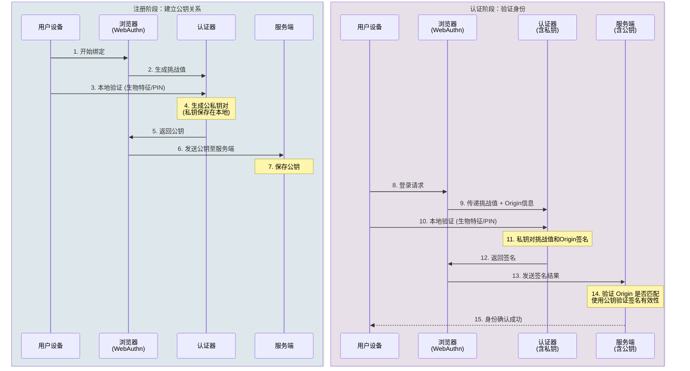

## 一、FIDO 简介

FIDO 是一种基于公钥密码学的身份认证标准，目标是减少密码依赖，并提高登录环节的安全性。当前企业实际采用最多的是 FIDO2。2013 年 FIDO 联盟成立，2018 年 WebAuthn 成为 W3C 推荐标准，FIDO2 由此进入主流浏览器和操作系统生态。它由浏览器侧接口 WebAuthn 和终端到认证器通信协议 CTAP 组成，核心机制是服务端保存公钥，用户设备本地保存私钥，登录时由本地私钥完成签名，服务端使用公钥验签。

从实现形态看，FIDO 认证器通常分为两类。平台认证器集成在终端内部，例如 Windows Hello、macOS Touch ID 或手机安全模块；跨平台认证器则是独立硬件，例如 USB、NFC 或蓝牙安全密钥。对工程实践来说，FIDO 更适合作为一套强认证标准来理解。

## 二、FIDO 适用场景

FIDO 最适合放在登录入口、高风险操作和高权限账号管理这三类场景中。

在登录入口场景中，它适用于企业统一身份入口、办公系统、SaaS 应用、管理后台和远程访问门户。对于公网接入、远程办公和高钓鱼风险环境，这类能力的价值最直接。

在高风险操作场景中，FIDO 适合用于二次确认，例如导出敏感数据、修改核心配置、执行删除或停机操作，以及访问特权账号和生产环境。此时它通常作为步进认证能力使用，在关键动作发生前再次确认操作者身份。

从用户类型看，FIDO 既适合普通办公用户，也适合高权限用户。前者主要用于替代密码并提升登录体验，后者主要用于提高身份确认强度。对于高权限岗位，独立硬件安全密钥通常比单纯依赖终端内置认证器更稳妥。

## 三、FIDO 原理

FIDO 的工作机制可以分为注册和认证两个阶段。

注册阶段的目标是建立公钥关系。用户首次为某个系统绑定 FIDO 凭据时，业务系统生成一次性的挑战值并发送给浏览器，浏览器调用本地认证器创建新凭据，认证器在用户完成本地验证后生成一对公钥和私钥，并将公钥返回给业务系统。至此，服务端保存公钥，私钥保留在本地。

认证阶段的目标是验证用户是否仍然掌握对应私钥。用户后续登录时，业务系统生成新的挑战值，浏览器调用与当前站点匹配的凭据，认证器在用户完成本地验证后使用私钥对挑战值和上下文数据签名，业务系统再使用已保存的公钥完成验签。由于挑战值每次都不同，历史认证结果不能直接重放。

FIDO 的关键安全能力来自来源绑定。浏览器会根据当前访问站点生成来源标识 Origin，并把它与挑战值一起交给认证器处理。这样生成的签名只能在对应站点通过校验，钓鱼站点即便转发真实系统的挑战值，也无法把结果用于真实站点。

## 四、优点

FIDO 的优点主要体现在安全性、架构实现和使用体验三个方面。

首先是抗钓鱼能力更强。传统密码、短信验证码和通用动态口令，通常只能证明用户提交了正确数据，却很难证明这些数据是不是在正确的访问目标上完成的。FIDO 把当前访问站点的来源信息纳入认证过程，认证结果因此与访问目标绑定。攻击者即使通过中间人方式转发挑战值，也难以把生成结果用于真实站点。

第二个优点是服务端不再保存共享秘密。FIDO 体系下，服务端保存的是公钥，而不是密码或等价秘密。这意味着即使服务端数据发生泄露，攻击者也无法直接获得可用于登录的凭据。对企业而言，这一点能够明显降低密码库泄露、撞库和凭据批量滥用带来的风险。

第三个优点是更容易兼顾安全与体验。FIDO 可以直接调用终端原生的指纹、人脸、PIN 或硬件密钥能力，用户侧的交互成本通常低于频繁输入密码、验证码和动态口令。对企业统一身份入口、高频办公访问和跨系统登录场景来说，这一点具有很强的工程价值。

## 五、与 UKey、SSH 公钥认证有什么区别

传统 UKey 多数建立在证书体系之上，核心能力来自公钥基础设施，也就是 PKI。它通常依赖证书链、有效期、吊销、驱动和中间件，更适合证书认证、签章、双向认证和成熟 PKI 体系场景。FIDO 更强调 Web 登录场景中的原生集成和抗钓鱼能力，服务端实现也更轻，重点在于公钥与凭据管理。对企业来说，如果目标是提升用户登录安全和抗钓鱼能力，FIDO 通常更合适；如果目标是支撑证书链和传统密码基础设施，UKey 仍然具有明确价值。

SSH 公钥认证与 FIDO 在底层逻辑上相似，都是服务端保存公钥、客户端持有私钥、认证时由私钥完成签名。区别在于，SSH 传统私钥通常以文件形式保存在终端，本地防护要求更高；FIDO 私钥通常保存在安全硬件或受保护执行环境中，并引入了来源绑定和本地用户验证机制。SSH 更适合命令行远程登录，FIDO 更适合 Web 登录和统一身份入口。

与传统指纹 Key 相比，FIDO 的差别主要在于服务端能否获得清晰的用户验证证据。很多传统指纹 Key 只是在本地完成指纹解锁，服务端看到的仍然是证书签名结果。FIDO 体系中，用户验证状态可以进入认证证据链，因此在双因素和合规解释上通常更容易成立。

## 六、等保、密评等符合性分析

### FIDO 与双因素认证的关系

FIDO 能否满足等保的双因素认证要求，核心取决于认证过程中涉及的认证因子类型。在多因子认证的定义中，认证因子分为三类：所知（用户知道的秘密）、所持（用户持有的设备或令牌）和所有（用户的生物特征）。形成真正的多因子认证，必须同时使用其中两类或以上的证明。

从 FIDO 的实现方式看，它提供的因子组合具体包括：

**第一层：所持因子** - FIDO 凭据本身就是所持因子的表现形式。用户绑定 FIDO 凭据时，认证器生成一对公私钥，私钥保存在用户的认证器中。这个认证器可能是硬件安全密钥（如 USB 密钥），也可能是终端内置的平台认证器（如 Windows Hello、iOS Secure Enclave）。用户的登录认证依赖于这个物理对象或受保护的硬件环境。

**第二层：生物特征或 PIN** - FIDO 认证不匿名，它强制用户在签名前完成本地用户验证（User Verification，简称 UV）。这个验证过程可以是：
- 指纹、人脸或虹膜识别（所有因子）
- PIN 码输入（所知因子）
- 窗口生物认证（所有因子）

因此，标准的 FIDO 认证过程实际上是 "所持 + 所有/所知" 的组合，满足多因子认证的定义。

### 等保合规要求

在等级保护标准中，三级及以上系统需要对管理员、运维人员、远程访问等关键角色实施增强身份鉴别。FIDO 通过所持因子（认证器）和所有/所知因子（生物特征或 PIN）的组合，提供了多因素认证能力，完全满足增强身份鉴别的要求。其中，认证过程还包含了**密码学保护**：

1. **密码算法保护**：FIDO 使用 ECDSA 或 EdDSA 等公钥密码算法，此过程涉及私钥签名和公钥验签；
2. **挑战-应答机制**：每次认证时服务端生成不可预测的挑战值，认证器使用私钥对挑战和上下文数据进行加密签名，确保认证过程包含密码学保护；
3. **来源绑定**：浏览器将当前访问站点的来源信息纳入签名内容，使签名与访问目标绑定，技术上由密码学保证的来源验证机制实现。

对于等保三级及以上系统，实施 FIDO 作为双因素认证的关键要素是：
- 明确需要用户验证（User Verification enabled），而不仅仅是用户在场（User Presence）；
- 保留完整的认证策略、日志记录，证明每次登录都完成了两层验证；
- 配置降级路径控制，即当 FIDO 不可用时的备选方案；
- 对管理员、运维人员和远程访问入口等关键角色优先应用 FIDO 双因素认证。

### 密评合规分析

在密评场景中，关注重点会转向密码算法和全链路适配情况。FIDO 的评估重点通常包括：

1. **密码算法合规**：FIDO 认证器使用的签名算法（如 ES256、RS256）是否与国家密码政策相符；如果要求国密算法，则需评估认证器是否支持国密SM2、SM3、SM4 等算法；
2. **链路完整性**：浏览器、客户端、认证器和服务端是否能够完整透传密码学保护，特别是在 HTTPS 通道、认证器通信和签名验证各环节；
3. **服务端验证**：服务端验证组件是否正确实现了公钥验签，是否正确处理签名中的来源绑定和时间戳信息；
4. **密钥管理**：私钥在认证器中的保存和使用是否符合密码管理规范，是否包含密钥导入、导出、吊销等生命周期管理能力。

### 国密适配与 PKI 分工

从实际工程边界看，面向互联网和通用办公系统，FIDO 的工程成熟度和安全收益通常更突出；面向严格国密要求且已有成熟 PKI 基础设施的场景，传统国密证书体系通常具有更高确定性。对于既要提升登录安全、又要兼顾合规的场景，较稳妥的做法通常是让 FIDO 与 PKI 分工协作：使用 FIDO 承担用户登录和高风险操作的强认证，使用国密证书体系承担机器身份、系统间通信和电子签章等场景。

## 七、全球与国内的产业化落地全景

从时间线上看，FIDO2 的产业化大致经历了三个阶段：2013 年到 2017 年是技术形成和早期验证期，2018 年到 2021 年是标准定型和生态铺开期，2022 年以后进入政策推动和规模化落地期。整体上，欧美市场由平台生态和政策共同驱动，国内市场则更多由头部企业、安全需求升级和合规要求牵引。

国外推进更快。2018 年标准成熟后，FIDO2 先进入浏览器和操作系统生态；2021 年后，美国联邦零信任政策持续推进，2022 年 OMB M-22-09 明确要求采用抗钓鱼多因素认证；同一时期，苹果、谷歌、微软集中推动 Passkey。到 2023 年和 2024 年，FIDO2 已同时进入消费者账号体系和政企统一身份平台。

国内起步略晚。2020 年前后，头部互联网企业开始把 FIDO2 用于内部零信任接入和高权限操作确认；2022 年以后，随着终端生态成熟和国密适配产品增多，金融、央国企、政务等行业开始试点；到 2024 年至 2026 年，市场已进入重点行业加速落地阶段。国内推进较慢的主要原因，是既有认证体系存量较大，同时还要兼顾等保、密评和国密适配要求。

从行业看，互联网和大型科技企业最早成熟，金融行业近几年推进最快，政府和关键行业仍以试点和分阶段落地为主。医疗、制造、能源等行业则更多把 FIDO2 用在共享终端登录、远程运维入口和高风险访问控制上。

当前落地最典型的三类场景是：面向员工的 B2E 内部办公与运维访问，面向消费者的 B2C 无密码登录与高价值交易确认，以及共享设备和特权访问控制。对零信任建设而言，最有现实价值的仍然是内部强认证和高危操作提权控制。

对国内多数企业而言，更现实的路径不是一次性全面替换，而是先在统一身份入口、远程接入、特权账号和关键操作复核场景中建立能力，再逐步扩展到更多业务系统。

## 结语

综合来看，FIDO2 的技术意义在于，它把身份认证的核心依据从服务端保存的共享秘密，转移到本地私钥证明、用户验证和来源绑定之上。由此带来的变化，不只是登录方式的改变，更是认证证据结构和信任建立方式的变化。

在工程实践中，FIDO2 更适合承担用户侧强认证能力，尤其适用于统一身份入口、远程访问、特权账号和高风险操作确认等场景；而在机器身份、证书治理和严格密码合规要求较强的环境中，仍需与 PKI 等机制配合使用。就当前技术成熟度和产业落地情况而言，FIDO2 已经从可选方案发展为现代身份体系中的重要组成部分。
