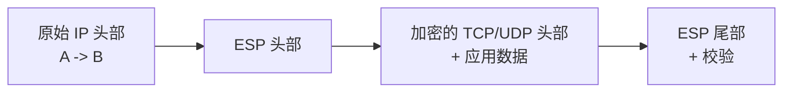
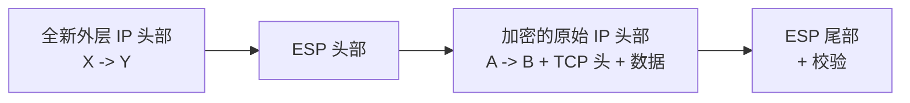
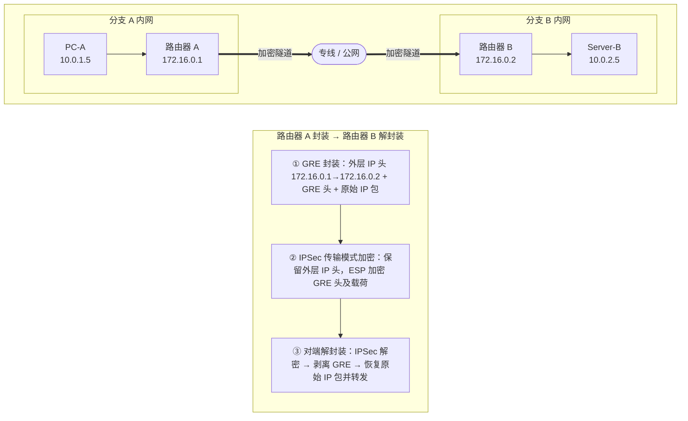
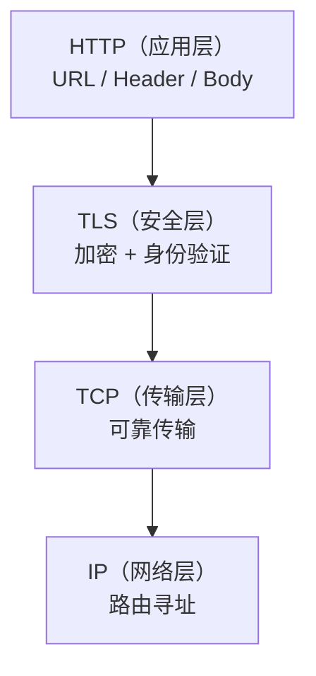
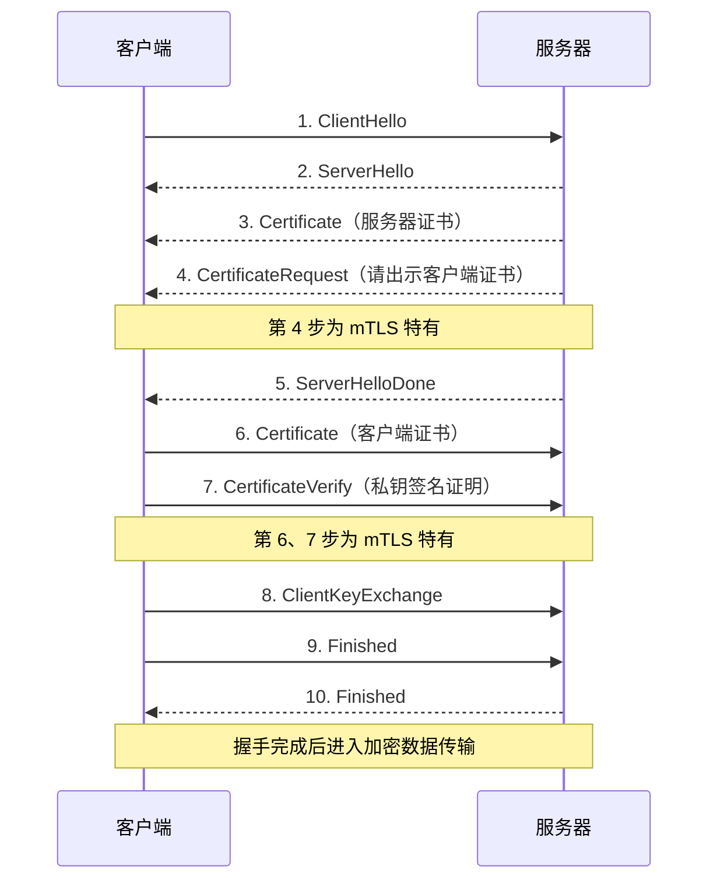

本文梳理企业网络中常见隧道与加密协议的工作原理、报文结构和适用场景。

---

## 一、隧道与加密

隧道和加密经常一起出现，作用却不同。

隧道（Tunnel）负责封装与穿越。它把一种网络协议的数据装进另一种协议，让原本隔离的两端获得逻辑连通。隧道可以不加密，GRE 就是明文隧道协议。

加密协议保护机密性与完整性，防止数据在传输中被窃听或篡改。TLS 在已有 TCP 连接上提供保护，不会改变数据的路由路径。

有些协议兼具两种能力：IPSec 的隧道模式既构建了隧道（套了一层新 IP 头），又提供了加密。有些方案则是将两者组合使用：GRE 负责修隧道，IPSec 负责加密。

### 1.1 “N 层隧道”的命名由来

"二层"和"三层"直接借用 OSI 七层模型的层级编号。所谓"N 层隧道"，指的是**隧道内部封装的数据属于 OSI 第 N 层**：

- **二层隧道**：内部封装的是完整的**以太网帧**（数据链路层，第 2 层）
- **三层隧道**：内部封装的是 **IP 数据包**（网络层，第 3 层）

SSH 端口转发也可以视为应用层隧道，SOCKS5 代理则工作在更高层。不过在网络工程的日常沟通中，“隧道”多指二层和三层方案，用于连接物理隔离的网络。更高层方案一般称为代理或端口转发。

### 1.2 二层隧道

二层隧道封装完整的以太网帧，包括源和目的 MAC 地址。打通后，两端设备在逻辑上位于同一子网，广播、组播和自定义二层协议都可以透传。

- **典型协议**：VXLAN、L2TP、OpenVPN 的 TAP 模式
  > TAP 是操作系统提供的二层虚拟网卡接口。OpenVPN 运行在 TAP 模式下时以二层帧为传输单位，从而实现二层隧道。TAP 属于内核网络设备抽象，不定义传输协议，多种 VPN 软件都可以使用它。
- **适用场景**：跨园区组建统一局域网、局域网联机游戏、依赖广播发现机制的应用（如 ARP、DHCP、局域网打印机发现）

### 1.3 三层隧道

三层隧道封装的是 IP 数据包。两端网络仍然是独立子网，需要通过路由表决定哪些流量走隧道，不转发广播和组播（除非配合额外协议）。

- **典型协议**：IPSec、GRE、WireGuard、OpenVPN 的 TUN 模式
  > TUN 是操作系统提供的**三层虚拟网卡接口**，只处理 IP 包，不涉及 MAC 地址。与 TAP 的关系类比：TAP 模拟网线插在交换机上（二层），TUN 模拟直连路由器接口（三层）。
- **适用场景**：企业分支机构互联、远程接入 VPN、跨云网络互通

小结：二层隧道把异地网络"缝合"为同一个局域网（二层帧全部透传），三层隧道把异地网络变成可通过路由互访的两个独立网络（只传 IP 路由包，更高效）。

---

## 二、基于 IPSec 的隧道方案

### 2.1 IPSec

IPSec（Internet Protocol Security）是对 IP 协议的安全扩展，工作在 OSI 第三层（网络层）。它处理的最小单位是 IP 数据包，核心组件是 **ESP（封装安全载荷）**，提供加密和数据完整性校验。

根据封装方式不同，IPSec 有两种工作模式。

#### 传输模式（Transport Mode）

ESP 只加密 IP 数据包的**有效载荷**（TCP/UDP 头部 + 应用数据），**保留原始 IP 头部不变**。



#### 隧道模式（Tunnel Mode）

ESP 将**整个原始 IP 数据包**（含原始 IP 头部）全部加密，然后在最外面加上一个**全新的 IP 头部**。



#### 两种模式的差异与选择

| 维度 | 传输模式 | 隧道模式 |
|------|---------|---------|
| 加密范围 | 仅加密 IP 载荷，保留原始 IP 头 | 加密整个原始 IP 包，套新 IP 头 |
| 加解密执行者 | 通信的终端主机自身 | 两端的网关/路由器 |
| 是否隐藏内部拓扑 | 否，原始 IP 暴露 | 是，内网 IP 完全不可见 |
| 是否支持私有 IP 跨公网 | 否，私有 IP 无法公网路由 | 是，外层使用公网 IP |
| 报文开销 | 较小（无额外 IP 头） | 较大（多一个 20B 的外层 IP 头） |
| 典型场景 | 机房内主机间加密、配合 GRE 使用 | 企业 VPN、SD-WAN 站点互联 |

传输模式有一个硬性约束：执行 IPSec 加密的设备 IP 必须与原始数据包的源或目的 IP 一致。它只能加密自己发出的流量，无法代理转发其他设备的流量。站点互联场景中，路由器转发内网流量时不能单独使用传输模式，与 GRE 组合则可以绕开这个限制。

隧道模式是目前企业 VPN 和 SD-WAN 中最常用的模式。

### 2.2 纯 IPSec 的局限

纯 IPSec 不支持组播（Multicast）和广播，只能传输单播流量。两台路由器因此无法直接运行依赖组播发现邻居的 OSPF。网段一多，完全依靠静态路由会很难维护。

GRE（Generic Routing Encapsulation，通用路由封装）可以封装 IP 组播包和广播包，OSPF 使用的 `224.0.0.5` 组播地址就能从中受益。这里的组播和广播发生在 IP 层，不包含以太网帧层面的广播。标准 GRE 封装 IP 数据包，所以 GRE over IPSec 仍属于三层隧道。

> **补充：组播和广播也分二层与三层**
>
> 二层和三层都有各自的组播与广播形式：
>
> | 类型 | 二层（以太网帧级别） | 三层（IP 包级别） |
> |------|--------------------|-----------------|
> | 广播 | 目的 MAC 为 `FF:FF:FF:FF:FF:FF`，到达同一 LAN 内所有设备 | 目的 IP 为 `255.255.255.255` 或子网广播地址（如 `192.168.1.255`） |
> | 组播 | 特殊组播 MAC（如 `01:00:5E:...`），用于 STP 等链路层协议 | 目的 IP 在 `224.0.0.0/4` 范围，如 OSPF 的 `224.0.0.5` |
>
> 二层隧道（如 VXLAN、L2TP）透传以太网帧，所以 ARP 请求、DHCP Discover 等二层广播可以直接穿过隧道。三层隧道中的 GRE 封装 IP 包，能传输 OSPF 使用的 IP 组播，却不会透传以太网帧级广播。纯 IPSec 只能处理点到点的单播 IP 包，连 IP 组播也不支持。

### 2.3 GRE over IPSec

以下是一个典型的 GRE over IPSec 示意，两端分支机构通过专线连接：



第 ② 步最重要。GRE 封装后，最外层 IP 头使用两台路由器的接口 IP（`172.16.0.1 → 172.16.0.2`），满足 IPSec 传输模式对源和目的地址的要求，因此无需再增加一层 IP 头部。

以 AES-256-GCM 加密算法为例的报文开销对比：

| 方案 | 附加开销（估算） | 说明 |
|------|----------------|------|
| 纯 IPSec 隧道模式 | ~58 ~ 76 字节 | 外层 IP 头(20B) + ESP 头(~8B) + IV(~16B) + ESP 尾部/填充 + 校验 |
| GRE over IPSec（传输模式） | ~62 ~ 80 字节 | 与上者相比，外层 IP 头同为 20B（由 GRE 产生），但多了 4B 的 GRE 头 |

两者开销很接近。GRE over IPSec 多出约 4 字节，可以承载 OSPF 等依赖组播的动态路由协议。BGP 使用 TCP 单播，也可以借助 GRE 建立灵活的逻辑拓扑。

### 2.4 L2TP over IPSec

L2TP over IPSec 与 GRE over IPSec 都由明文隧道协议负责封装，再由 IPSec 提供加密保护，并配合 IPSec 传输模式使用。

它们之间有两个核心差异：

第一处差异是封装层级。GRE 封装三层 IP 数据包，包括 IP 组播，隧道两侧仍是通过路由互访的独立子网。L2TP 封装二层 PPP 帧，远端设备通过 PPP 获取内网 IP，逻辑上更接近直接接入企业网络。

> 补充：GRE 协议实际上也支持封装以太网帧（称为 EoGRE，Ethernet over GRE），此时它就变成了二层隧道。但在标准的 GRE over IPSec 企业组网方案中，GRE 封装的是 IP 数据包，用于跑动态路由协议，属于三层隧道的用法。

**差异二：设计场景不同。** GRE 面向站点互联（Site-to-Site），解决的是路由器之间跑动态路由的需求；L2TP 面向远程拨号接入（Client-to-Site），解决的是个人终端远程获取内网 IP 和账号认证的需求。L2TP 基于 UDP 传输，NAT 穿越能力强，加上 Windows/macOS/iOS/Android 均原生支持，无需额外安装客户端，因此在远程接入场景中使用广泛。

| 维度 | GRE over IPSec | L2TP over IPSec |
|------|---------------|-----------------|
| 内部封装层级 | 三层（IP 数据包） | 二层（PPP 帧） |
| 场景 | 站点互联（Site-to-Site） | 远程拨号接入（Client-to-Site） |
| 主要能力 | 支持组播、运行动态路由协议 | 账号认证、IP 分配、二层漫游 |
| 额外协议头 | GRE 头（4B） | PPP 头(4B) + L2TP 头(~8B) + UDP 头(8B) |
| 报文开销 | 比纯 IPSec 多 ~4 字节 | 比纯 IPSec 多 ~20+ 字节 |

GRE 是 IETF 公开标准（RFC 2784），无需运营商授权。它直接使用 IP 协议号 47，独立于 TCP（协议号 6）和 UDP（协议号 17）。部分小型运营商或家用 NAT 网关只放行 TCP、UDP，会丢弃协议号 47，导致 GRE 隧道无法建立。L2TP 运行在 UDP 1701 端口上，对 NAT 和防火墙的兼容性通常更好，可在受限网络中替代 GRE。

---

## 三、TLS 与 mTLS

### 3.1 与隧道协议的区别

前面讲的 IPSec、GRE 都是工作在 IP 层的**网络层协议**，它们要解决的核心问题是"让两个网络在逻辑上连通"，因此被称为隧道。

TLS 工作在 TCP 连接之上，为已经能够通信的两端提供加密和身份验证。它不改变路由路径，也不在 IP 层增加封装头，所以通常归入加密协议或安全协议。

不过在实际使用中，这条界线有时会模糊。比如在零信任架构中，mTLS 连接本身会承载被封装的内网流量，此时它事实上也充当了一种"应用层隧道"的角色。

### 3.2 TCP、TLS 与 HTTP

理解 TLS/mTLS 之前，需要先厘清三者的层级关系：

- **TCP（传输层）**：负责建立可靠的端到端字节流管道。TCP 本身不提供加密，数据以明文传输。
- **TLS（安全层）**：直接架在 TCP 之上的加密协议，对 TCP 管道中的数据进行加密保护。TLS 不区分 HTTP、gRPC 或 MySQL，上层内容对它来说都是字节流。
- **HTTP（应用层）**：定义具体的业务语义（URL、Header、Body 等）。

三者的组合关系：



任何基于 TCP 的应用层协议都可以使用 TLS，例如 gRPC、MySQL 和 MQTT。HTTPS 只是最常见的应用形式。

### 3.3 加密流程

一次 TLS 加密通信分三个阶段：

1. **TCP 三次握手**：建立可靠的传输管道（此时仍为明文通道）。
2. **TLS 握手**：服务器出示数字证书证明自身身份，双方通过非对称加密算法（RSA/ECC）协商出对称会话密钥（Session Key）。TLS 1.3 将握手优化为 1-RTT（首次连接）甚至 0-RTT（恢复连接），比 TLS 1.2 的 2-RTT 显著减少延迟。
3. **加密数据传输**：后续所有 TCP 有效载荷使用协商好的对称密钥加密。

### 3.4 报文格式

TLS 数据包封装在 TCP Payload 中，外层的 TLS Record Header 固定为 **5 字节**：

```
+----------------------------------------------------------+
| Content Type (1B) | Version (2B) | Payload Length (2B)    |
+----------------------------------------------------------+
|               TLS Payload (Fragment)                      |
+----------------------------------------------------------+
```

- `Content Type`：标识 Payload 类型，包括 `0x16`（Handshake）、`0x17`（Application Data）和 `0x15`（Alert）
- `Version`：协议版本，TLS 1.2 为 `0x0303`（TLS 1.3 为兼容旧设备仍写 `0x0303`，真实版本在扩展字段协商）
- `Length`：后续 Payload 的字节长度（最大 16KB）

握手完成后，`Content Type: 0x17` 的 Payload 是被 AEAD 算法（如 AES-256-GCM 或 ChaCha20-Poly1305）加密的密文及 MAC 认证标签。

### 3.5 mTLS

普通 TLS 采用单向认证，客户端通过证书验证服务器身份，服务器不会在 TLS 握手中验证客户端身份。

mTLS（Mutual TLS，双向 TLS）在此基础上增加了反向验证：**服务器也强制要求客户端出示证书**。只有双方都验证了对方的合法性，TLS 连接才能建立。

两者在握手完成后的加密数据包结构完全一致，差异只在握手阶段（以下以 TLS 1.2 为例，TLS 1.3 的流程有所简化，但双向证书认证方式不变）：



mTLS 握手中服务器多发了一个 `CertificateRequest`（Handshake Type `0x0D`），客户端多回了两个报文：

| 报文 | Handshake Type | 作用 |
|------|---------------|------|
| CertificateRequest | `0x0D` (13) | 服务器要求客户端出示证书，声明支持的签名算法和可信 CA 列表 |
| Certificate | `0x0B` (11) | 客户端发送完整的 X.509 证书链（叶子证书 + 中间 CA） |
| CertificateVerify | `0x0F` (15) | 客户端使用私钥对前序握手报文的摘要签名，证明真正拥有该证书 |

### 3.6 mTLS 适用场景

mTLS 在网络连接建立阶段完成设备或服务身份认证，无需等到应用层登录：

- **零信任网关准入**：只有安装了企业 CA 签发证书的终端设备才能与网关建立连接，未授权设备在 TLS 握手阶段即被拒绝。
- **微服务间通信**：服务 A 调用服务 B 的 gRPC 接口时，双方通过 mTLS 互验证书，防止未授权服务伪造调用。
- **数据库安全连接**：业务服务器连接 MySQL 时，数据库要求客户端出示证书，拒绝未经认证的连接。
- **物联网设备认证**（MQTT over mTLS）：云平台只接受持有合法证书的 IoT 设备上报数据。

---

## 四、其他常见协议

除了上述企业级的经典协议外，还有一些在不同场景中广泛使用的协议值得了解。

### 4.1 WireGuard

WireGuard 是三层加密隧道协议，于 2020 年正式合入 Linux 内核，常被用作轻量的 IPSec 替代方案。

| 维度 | IPSec | WireGuard |
|------|-------|-----------|
| 代码量 | 数十万行 | 约 4000 行 |
| 加密算法 | 可协商（灵活但配置复杂） | 固定使用 ChaCha20 + Curve25519（零配置） |
| 协议层级 | IP 层（协议号 50/ESP） | UDP 封装（易穿越 NAT） |
| 连接模型 | 需要复杂的 IKE 协商 | 基于公钥的静态配对，1-RTT 握手 |
| 性能 | 较高（硬件加速成熟） | 极高（内核态，代码路径短） |

WireGuard 的设计哲学是极简：固定加密算法避免了协商开销和配置错误，UDP 封装让它在 NAT 环境下比 IPSec 更容易穿透。

### 4.2 Tailscale / Headscale

Tailscale 是基于 WireGuard 构建的**零配置 Mesh VPN** 服务。它的核心贡献不在协议层面（底层就是 WireGuard），而在控制面：

- **自动 NAT 穿透**：集成了 STUN/DERP 打洞技术，设备之间即使在复杂 NAT 后面也能直连。
- **节点自动发现**：通过中央协调服务器（Coordination Server）自动分发公钥和路由信息，不需要手动配置。
- **身份集成**：使用 SSO（如 Google、GitHub 账号）做身份认证，替代传统 VPN 的预共享密钥。

Headscale 是 Tailscale 控制面的开源替代实现，允许自建协调服务器，适合不希望将节点信息托管给第三方的场景。

### 4.3 Cloudflare Zero Trust

Cloudflare 的零信任方案由两个组件构成：

- **Cloudflare WARP**（客户端侧）：安装在用户终端的 Agent，底层使用 WireGuard 协议（Cloudflare 称之为 BoringTun，是 WireGuard 的用户态 Rust 实现）。它将用户流量加密后发往最近的 Cloudflare 边缘节点。
- **Cloudflare Tunnel**（服务端侧）：安装在企业内网服务器上的 `cloudflared` 守护进程，使用 HTTP/2 或 QUIC 协议主动向 Cloudflare 边缘建立出站连接。这种"反向连接"的设计使得内网服务器无需暴露任何入站端口。

两者通过 Cloudflare 的全球边缘网络中转，配合身份验证（OIDC/SAML）实现零信任访问控制。

### 4.4 代理协议

这类协议工作在应用层或会话层，主要用于代理流量，并通过流量伪装规避深度包检测（DPI）。它们不负责连接两个网络。

| 协议 | 工作层级 | 传输方式 | 核心特点 |
|------|---------|---------|---------|
| Shadowsocks | 应用层 | TCP/UDP | 将数据加密为无特征的随机字节流 |
| Trojan | 应用层 | TLS (TCP 443) | 伪装为标准 HTTPS 流量，与正常网页流量几乎不可区分 |
| VLESS | 应用层 | 可选 WebSocket/gRPC/TLS | VMess 的精简版，降低协议头开销 |
| Hysteria 2 | 应用层 | QUIC (UDP) | 基于 QUIC 协议，利用 UDP 多路复用和前向纠错优化高延迟、高丢包网络的性能 |

这些协议通常运行在本地代理客户端（如 mihomo/Clash、sing-box 等）与远端服务器之间。本地客户端通过 TUN 虚拟网卡或系统代理（SOCKS5/HTTP）接管终端流量，加密后发往服务器，服务器解密后代为访问目标站点。

IPSec 和 WireGuard 的加密流量较容易被 DPI 识别，例如持续出现的加密 UDP 包或 ESP 报文。代理协议会额外处理流量特征：Trojan 混入普通 HTTPS，Hysteria 模拟 HTTP/3 通信，Shadowsocks 使用随机化字节流。

---

## 五、适用场景总结

| 协议 | 工作层级 | 主要能力 | 典型场景 |
|------|---------|---------|---------|
| IPSec 隧道模式 | L3 | IP 包级加密 + 拓扑隐藏 | 企业 VPN、SD-WAN 站点互联 |
| IPSec 传输模式 | L3 | IP 载荷加密（省一层 IP 头） | 主机间直连加密、配合 GRE/L2TP 使用 |
| GRE | L3 | 通用封装（支持 IP 组播/广播） | 作为 IPSec 前置封装，支持动态路由 |
| GRE over IPSec | L3 | 路由互通 + 加密 | 多网段企业网、需要跑 OSPF 的场景 |
| L2TP over IPSec | L2 | 远程拨号 + 账号认证 + IP 分配 | 员工远程接入企业内网 |
| WireGuard | L3 | 轻量加密隧道 | 现代 Mesh VPN、轻量组网 |
| TLS | L5-L6 | 传输加密 + 服务器身份验证 | HTTPS 网站、数据库连接加密 |
| mTLS | L5-L6 | 双向证书认证 + 传输加密 | 零信任设备准入、微服务间通信、IoT |
| Tailscale | L3 (WireGuard) | 零配置 Mesh + NAT 穿透 + SSO 认证 | 个人设备互联、小型团队组网 |
| Shadowsocks/Trojan/VLESS | L7 | 流量加密 + 特征伪装 | 规避 DPI 审查的代理场景 |
