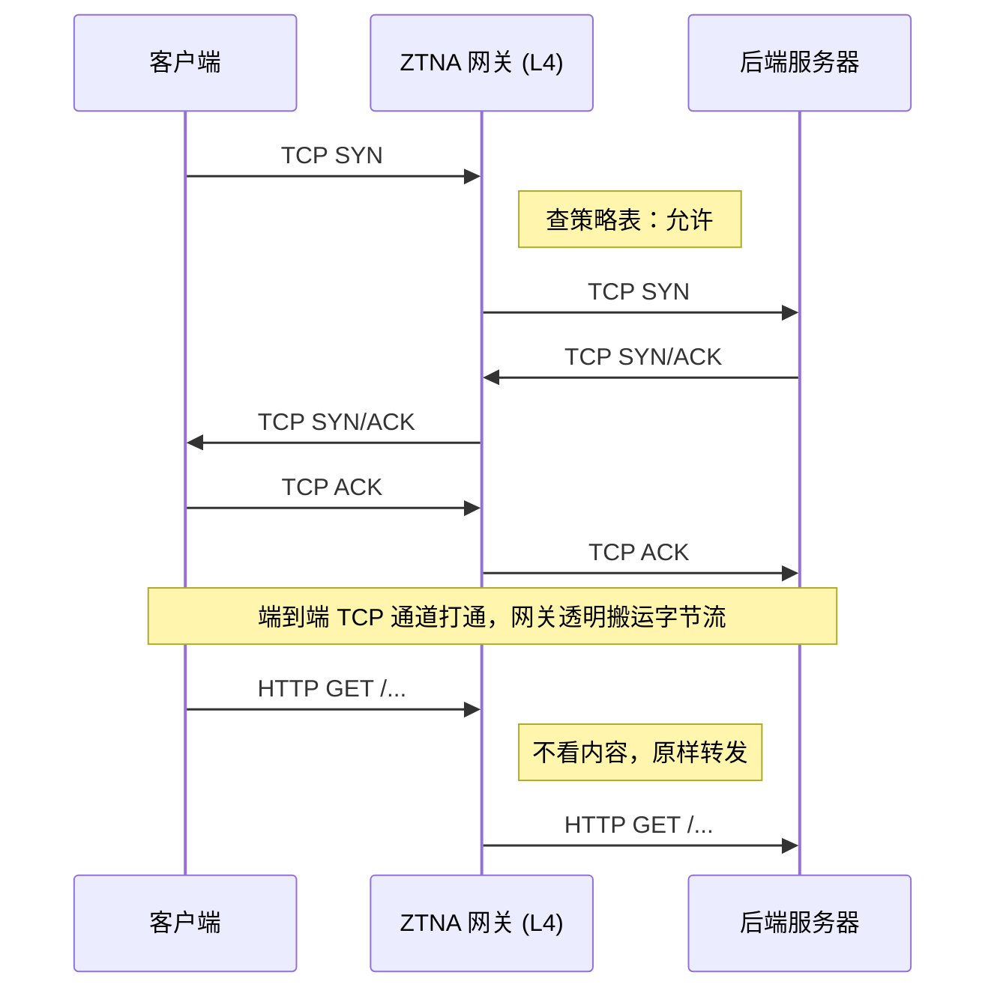
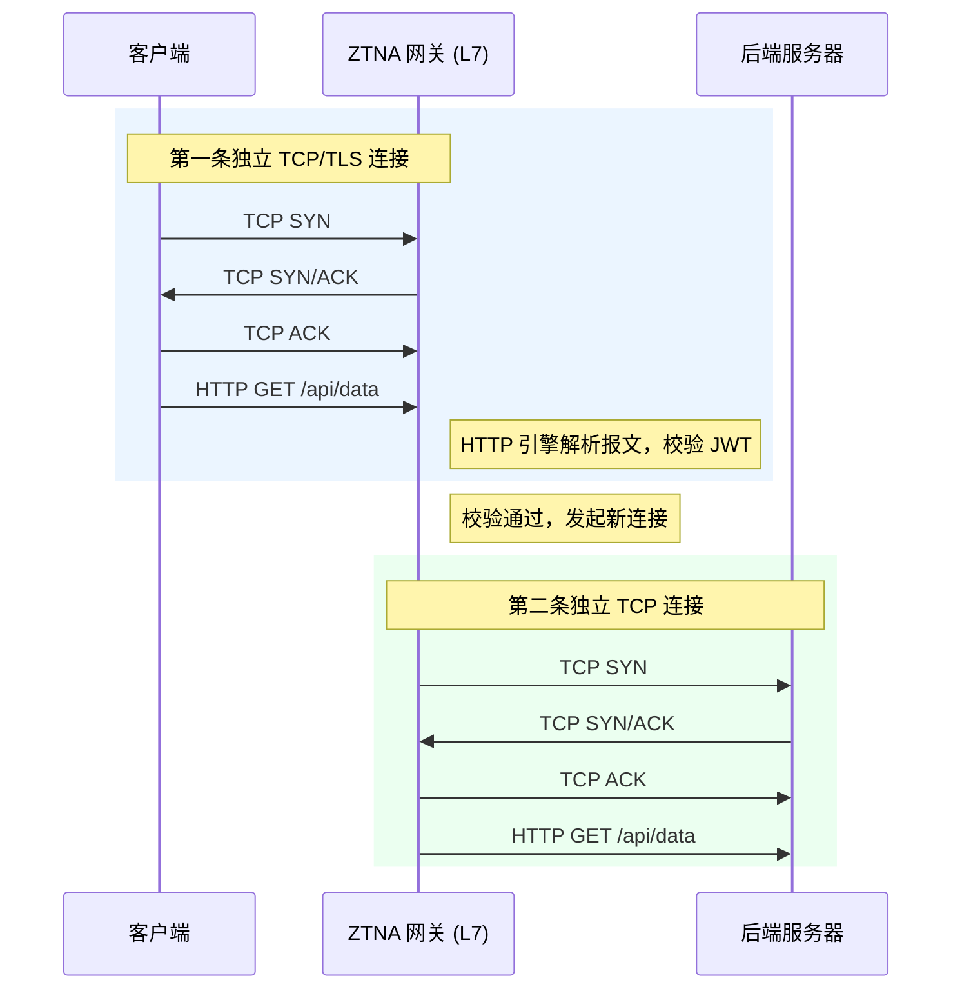
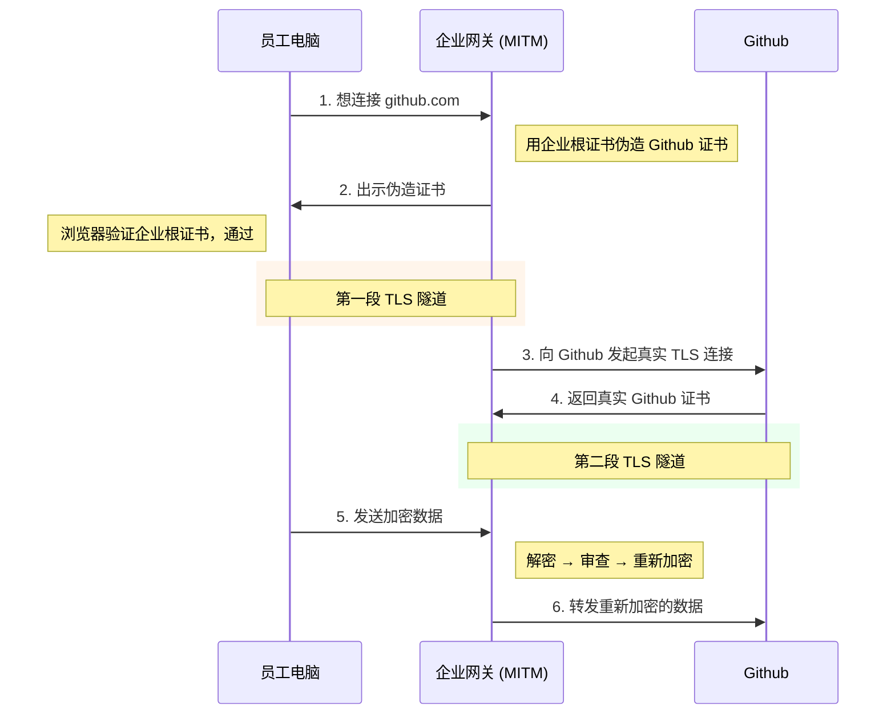
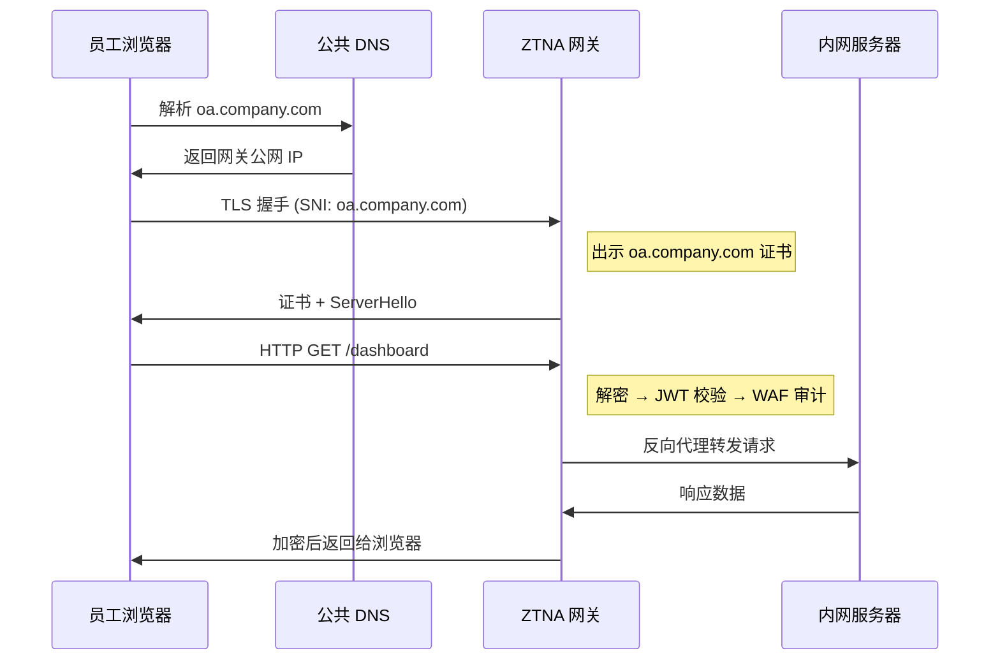
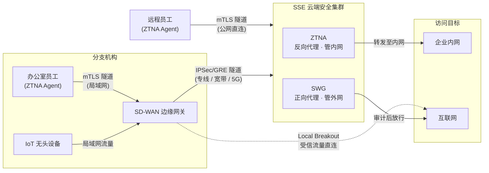

本文说明零信任网关的代理方式、终端引流路径，以及 SWG、SSE 和 SD-WAN 在企业网络中的分工。

---

## 一、网关

零信任强调持续验证。代理网关位于用户与目标资源之间，根据身份、设备状态和访问策略决定是否转发流量。

理解网关可以看三个维度：代理方向、协议层级和 HTTPS 解密能力。

### 1.1 方向：正向代理与反向代理

区分正向代理和反向代理，只需看代理服务器代表哪一端。

正向代理代表客户端向外部服务器请求数据，流量从内网经过网关访问公网，对外隐藏客户端真实 IP。企业上网行为管理和缓存加速都属于这类场景。

反向代理代表内部服务器接收请求，再把流量转回内网，对外隐藏服务器真实 IP。Nginx 负载均衡、CDN 和零信任业务发布都是常见用法。

在零信任架构中，这两种方向对应两个核心组件：

| 访问方向 | 代理类型 | 对应组件 | 网关角色 |
|---------|---------|---------|---------|
| 员工 → 内网业务 | **反向代理** | ZTNA | 挡在服务器前面，校验身份后才放行 |
| 员工 → 互联网 | **正向代理** | SWG | 代表员工访问公网，审查出站流量 |

### 1.2 深度：四层代理与七层代理

代理方向决定网关服务哪一端，协议层级决定它能解析多少内容。

#### 四层代理

四层代理是一种**连接透传（Connection Passthrough）** 架构。网关工作在传输层，不解析应用层内容，仅维护一张 TCP/UDP 连接映射表。



- 客户端到后端维持一条逻辑字节流，网关只修改 IP 和端口。
- CPU 开销低、延迟小，HTTP、MySQL、SSH 和私有协议都能透传。
- 网关看不到应用层内容，无法进行 URL 级权限控制、WAF 拦截或 API 审计。

#### 七层代理

七层代理是一种**连接终结（Connection Termination）** 架构。网关必须实现完整的 TCP/IP 协议栈和应用层协议解析。



- **核心特征**：客户端与后端之间**不存在**端到端 TCP 连接，被网关切为两条完全独立的连接
- **优势**：
  - TLS 卸载/终结：客户端→网关加密，网关→内网可明文
  - Header 修改：可注入 `X-Forwarded-For`、SSO 身份信息
  - 连接池复用：前端 1000 客户端，后端可能只维持 10 条长连接
  - API 级权限控制：可区分 `GET /api/logs` 与 `POST /api/config` 的不同权限
- **局限**：依赖应用层协议解析引擎，通常只支持 HTTP/HTTPS/gRPC 等标准协议。如果遇到 MySQL、RDP 等未配置解析器的二进制协议，网关会因无法识别报文格式而拒绝连接

#### 混合代理

实际落地中，两种深度通常共存。现代融合网关（如 Palo Alto Prisma Access、Zscaler Private Access）采用**协议嗅探 + 智能分流**：

1. 流量到达网关后，先进行协议嗅探。
2. 如果识别为 HTTP/HTTPS，切换到 L7 引擎做精细审计（URL 过滤、JWT 校验、WAF 等）。
3. 如果是非 Web 协议（SSH、RDP、数据库连接等），退化为 L4 透传，仅做连接级别的访问控制。

这种"双轨制"在业内已是主流实践：**七层做精控，四层做兜底**。Gartner 在 SSE 魔力象限报告中将"对非 Web 流量的 L4 兼容能力"列为 ZTNA 产品的核心评估维度之一。

### 1.3 解密：网关如何看穿 HTTPS

七层代理要做内容审计，必须看到 HTTP 明文。但现代流量几乎全部 HTTPS 加密。网关的解密方式取决于它充当的方向角色：

#### 反向代理场景：SSL 卸载

用于保护企业内部业务系统。网关本身就是合法的证书持有者。

1. IT 部门将业务域名的 HTTPS 证书和私钥导入网关。
2. 员工浏览器与网关完成 TLS 握手，网关出示合法证书。
3. 网关用私钥解密流量，提取 HTTP 明文进行审计。
4. 审计通过后，网关以明文 HTTP 或内部 TLS 重新连接后端服务器。

#### 正向代理场景：SSL 劫持

用于审计员工访问外部网站的流量。网关没有目标网站的私钥，需要执行**动态证书伪造**。



**浏览器为什么不报警？** 企业 IT 通过 AD 域策略或 MDM 系统，在员工电脑上预装了企业内部根证书并设为信任。网关伪造的证书由这张根证书签发，浏览器认为合法。

**隐私提示**：在安装了企业根证书的办公电脑上，所有 HTTPS 流量（包括个人邮箱、网银）对网关都是明文。企业通常会配置白名单（网银、医疗类域名不做 SSL 劫持），以规避法律和合规风险。

---

## 二、流量牵引：有端与无端

网关只有收到流量才能执行策略，终端因此还需要一条稳定的引流路径。

安装 ZTNA 客户端（Agent）后，终端可以通过 TUN 虚拟网卡拦截流量并送入加密隧道。外部合作伙伴的笔记本、BYOD 和访客手机往往无法安装企业客户端，还需要无端访问方式。

为了覆盖这些场景，零信任架构同时提供了不依赖客户端的接入方式。两种模式各有取舍：

| 维度 | 有端模式 | 无端模式 |
|------|---------|---------|
| 部署成本 | 需要安装客户端 | 零部署，浏览器直接访问 |
| 协议覆盖 | 全协议（HTTP、SSH、RDP、数据库等） | 仅 HTTP/HTTPS |
| 设备信任 | 可采集设备安全态势（磁盘加密、杀毒状态等） | 无法感知设备状态 |
| 攻击面 | 网关可隐藏公网端口（仅隧道端口对外） | 网关必须暴露 443 端口 |
| 适用场景 | 企业正式员工、长期设备 | 访客、合作伙伴、BYOD |

大多数企业的最佳实践是**有端为主、无端为辅**。

### 2.1 无端模式

流量牵引完全依赖 DNS 重定向：

1. IT 管理员将内部业务域名（如 `oa.company.com`）的 DNS A 记录指向零信任网关的公网 IP。
2. 浏览器向网关发起 TCP 连接和 TLS 握手。
3. 网关出示预先导入的 `oa.company.com` 证书（或 `*.company.com` 通配符证书），完成 TLS 握手。
4. 网关解密后提取 HTTP 报文，执行 JWT 校验、WAF 审计，通过后将请求反向代理到内网真实服务器。



报文结构（单层 TLS）：
```text
TCP → TLS (SNI: oa.company.com) → HTTP Payload
```
网关只需执行**一次解密**。

**证书要点**：

- 浏览器严格校验证书的 SAN/CN 字段与请求域名是否匹配，网关必须持有业务域名的合法证书和私钥。
- 通常在网关上配一张 `*.company.com` 通配符证书即可覆盖所有一级子域名业务，通过 HTTP `Host` 头部或 TLS SNI 做内部路由分发。
- 通配符证书只匹配一级子域名（`oa.company.com` ✅，`dev.oa.company.com` ❌）。

**局限**：网关必须在公网暴露 443 端口，存在被扫描和 0-day 攻击的风险；无法获取终端设备的安全态势；只能代理 HTTP/HTTPS。

### 2.2 有端模式

安装 ZTNA 客户端后，Agent 在操作系统底层接管流量，不依赖公共 DNS。

#### 流量牵引流程

**第一步：Split DNS 分流**

Agent 拦截操作系统的 DNS 请求（53 端口），根据从控制中心拉取的企业域名后缀列表进行智能分流：

- `baidu.com` → 放行，使用本地运营商 DNS 解析，走物理网卡。
- `oa.company.com`（命中企业后缀） → 通过 mTLS 隧道转发给企业内部 DNS 服务器。

DNS 解析有两种策略：

| 策略 | 原理 | 优势 | 劣势 |
|------|------|------|------|
| Fake-IP | Agent 不查真实 DNS，直接从保留网段（如 `198.18.0.0/15`）分配假 IP | 首包响应极快 | 污染本地 DNS 缓存，影响排障和部分客户端逻辑 |
| 真实 IP + 路由下发 | 通过隧道获取真实内网 IP，动态添加 `/32` 主机路由指向 TUN 网卡 | DNS 环境干净，审计可溯源 | 首包需等待远端 DNS 响应 |

主流企业级方案（Prisma Access、Cisco Secure Connect 等）采用后者。

**第二步：TUN 虚拟网卡吸入流量**

操作系统的 TCP 协议栈查找路由表，发现目标 IP 指向 TUN 虚拟网卡，流量被吸入 Agent。

**第三步：mTLS 隧道封装**

Agent 将 TUN 捕获的原始 IP 数据包封装进与网关预先建立的 mTLS 加密隧道中。

**第四步：网关双重解密**

报文结构（双层嵌套）：
```text
TCP → mTLS (外层隧道) → 原始 IP 头 → 原始 TCP 头 → TLS (SNI: oa.company.com) → HTTP Payload
```

网关执行两次解密：
1. **剥离隧道**：终结外层 mTLS，验证 Agent 的设备证书。
2. **业务卸载**：对内层 TLS 使用 OA 证书进行 SSL 卸载，提取 HTTP 明文审计。若内层是非 HTTP 流量（如 MySQL），则跳过第二次解密，退化为 L4 透传。

#### 有端模式的架构优势

1. **攻击面收敛**：网关可关闭公网标准 Web 端口，只暴露专属隧道端口。无合法证书的连接在底层被静默丢弃（SPA 单包授权理念）。
2. **设备信任闭环**：Agent 可实时采集 MAC 地址、硬盘加密状态、杀毒进程状态，在隧道建立前完成安全态势评估。
3. **L7/L4 平滑降级**：外层隧道建立后，网关可按内层协议切换代理模式，HTTP 走七层审查，其他协议走四层透传。

---

## 三、从 SWG 到 SASE

ZTNA 管理员工访问内网的流量。员工访问外部网站和 SaaS 时，则由 SWG 处理出站安全。

### 3.1 SWG

SWG（Secure Web Gateway，安全 Web 网关）是部署在云端的正向代理集群，可以理解为云化的上网行为管理服务。

如果只做内网流量管控（ZTNA），员工访问外部互联网的流量仍然是安全盲区：

1. **钓鱼跳板**：员工在外部访问恶意网站中木马后，木马利用员工设备上已建立的 ZTNA 隧道横向渗透到内网。
2. **数据泄露**：员工直接通过浏览器向外部网盘传输核心代码，企业无感知。
3. **影子 IT**：业务部门绕过 IT 使用未审批的外部 SaaS 处理敏感数据。

SWG 常见能力包括：

- **URL 过滤 / 恶意域名拦截**
- **DLP（数据防泄露）**：拆开 HTTPS 扫描上传文件是否包含敏感信息

云原生 SWG 会在多地部署 PoP（Point of Presence）边缘节点，并通过 Anycast 就近接入。员工在深圳上网时连接深圳节点，出差到柏林后连接当地节点。CDN 把内容推到边缘，SWG 则把安全检查能力放到边缘。

在有端模式下，Agent 同时承担 SWG 的入口分流角色，执行智能旁路（Bypass）：高带宽低风险流量（系统更新、视频会议、流媒体）直连不走 SWG，高风险需审计流量（未知网页、企业网盘类应用）强制入 SWG 隧道。

### 3.2 SD-WAN

SD-WAN（软件定义广域网）解决的是**网络连接**问题。它部署在各分支机构出口，将多条链路（专线、宽带、5G）捆绑，根据应用类型智能选路：

- 语音视频 → 走质量最好的专线
- 系统更新 → 走最便宜的普通宽带

SD-WAN 负责链路选择、网络效率和成本控制，本身不承担安全审计。

需要注意的是，**SD-WAN 不是所有企业的必选项**。它解决的是多分支机构的广域网优化问题，只有拥有大量物理办公网点的企业（零售连锁、制造业工厂、银行网点等）才需要。对于全远程办公、只有一两个办公室的中小企业或云原生公司，Agent + SSE 就是完整方案，不需要 SD-WAN。

### 3.3 SSE 与 SASE

SSE（Security Service Edge）是云端安全过滤集群，通常包含负责内网访问的 ZTNA 和负责外网访问的 SWG。SSE 可以独立部署，员工终端通过 Agent 直连云端后，即可同时使用两类能力。很多企业会从这里起步，再考虑是否引入 SD-WAN。

Gartner 在 2022 年将 SSE 从 SASE 中拆出，设立了独立的 SSE 魔力象限，正是因为大量企业只需要安全能力而不需要 SD-WAN。只有拥有大量分支机构、需要广域网优化的企业，才需要完整的 SASE 架构：

**SASE = SD-WAN（网络优化）+ SSE（安全审计）**

| 架构类型 | 组成 | 适用企业 | 代表场景 |
|---------|------|---------|----------|
| **纯 SSE** | Agent + ZTNA + SWG | 全远程办公、中小企业、云原生公司 | 员工全部装 Agent，无物理分支 |
| **完整 SASE** | Agent + ZTNA + SWG + SD-WAN | 多分支机构的传统企业 | 零售连锁、制造业工厂、银行网点 |



上图给出了分支机构接入 SASE 时的流量路径：

1. **SD-WAN 识别流量类型**
2. **智能分流**：
   - 受信 SaaS（如 Office 365）→ SD-WAN Local Breakout，本地宽带直连
   - 内网 ERP → 引流到 ZTNA 反向代理节点
   - 未知网页浏览 → 引流到 SWG 正向代理节点（通过 IPSec/GRE 隧道）

当 ZTNA 客户端和 SD-WAN 同时存在时，形成**双层 Overlay**：

1. **端点层**：ZTNA 客户端拦截流量，用 mTLS 加密并打上身份标签（JWT）和设备态势信息，发往云端 SSE 节点。
2. **网络层**：SD-WAN 路由器无法解密内层（被客户端 mTLS 加密），但识别出目标是 SSE 节点的 IP，选择最优链路传输。
3. **云端解包**：SSE 节点解开 mTLS，认出用户身份，执行 ZTNA 或 SWG 审计。

客户端负责加密和携带身份信息，SD-WAN 负责选路传输。

**无头设备的处理**：工厂中的打印机、摄像头、工控设备无法安装 Agent。这些设备的流量通过局域网到达 SD-WAN 边缘网关后，由网关代为封装进其与云端之间的 IPSec 隧道中转发至 SSE，执行基于 MAC/端口的简化零信任策略。

### 3.4 主流厂商与演进

| 阶段 | 时间 | 特征 |
|------|------|------|
| 硬件盒子 | 2000s - 2010s | 机房物理设备（Blue Coat 等），流量回总部清洗 |
| 云化 SaaS | 2010s 末 | Zscaler 首创纯云架构 SWG，解决 SaaS 流量绕行问题 |
| SASE 融合 | 2019 - 2021 | Gartner 定义 SASE，ZTNA 与 SWG 合并为统一平台 |
| SSE + AI | 2024+ | 集成 AI 实时分析零日钓鱼，识别 DLP 绕过行为 |

**国际**：Zscaler、Palo Alto Prisma Access、Cloudflare Zero Trust、Netskope、Cisco Umbrella

**国内**：深信服（SASE 方案国内接受度较高）、奇安信、绿盟、腾讯云 iOA

---

## 四、总结

| 概念 | 本质 | 解决的问题 |
|------|------|-----------|
| 正向代理 | 代表客户端访问外部 | 上网审计、DLP、恶意网站拦截 |
| 反向代理 | 代表服务器接收请求 | 内网资产保护、负载均衡 |
| 四层代理 | TCP 连接透传，协议无关 | 兼容非 HTTP 的传统业务 |
| 七层代理 | TCP 连接终结+重组，解析 HTTP | API 级权限控制、WAF、DLP |
| 无端模式 | DNS 重定向 + 单层 TLS 卸载 | 零部署成本的 Web 业务发布 |
| 有端模式 | TUN 接管 + mTLS 双层嵌套 | 设备信任、全协议覆盖、攻击面收敛 |
| SWG | 云端正向代理集群 | 替代传统硬件上网行为管理 |
| SSE | ZTNA + SWG 云端融合 | 安全能力统一交付，可独立部署 |
| SD-WAN | 智能广域网路由 | 多链路优化、降低专线成本（多分支场景） |
| SASE | SD-WAN + SSE 融合 | 网络效率与安全审计的统一架构（多分支场景） |

这些组件没有固定的全套组合。只有远程员工的企业可以先部署 SSE；分支较多、链路复杂时，再让 SD-WAN 负责选路。选型时先画清流量方向和信任边界，比直接比较厂商功能表更有用。
